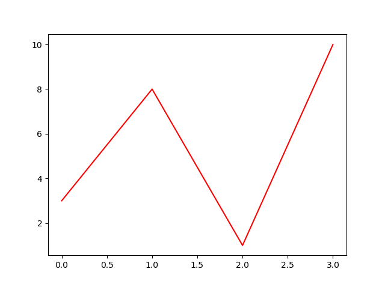
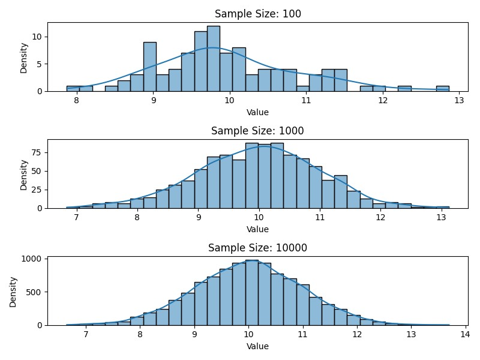

# Introduction to Data Science 2024

Welcome to the repository containing examples and information for the course Introduction to Data Science. More information 
 will, of course, be added as we go.

Authors:
- Tessel Haagen <tessel.haagen@code-cafe.nl>
- Lina Blijleven <lina.blijleven@code-cafe.nl>

The course is based on the Data Science Handbook from Jake vanderPlas, which is available online through [O'Reilly](https://www.oreilly.com/library/view/python-data-science/9781491912126/).

## Contents

- [Getting Started](#getting-started)
- [Learning Python](#learning-python)
- [NumPy](#numpy)
- [Pandas](#pandas)
- [Seaborn & Matplotlib](#seaborn--matplotlib)
- [Scikit-learn](#scikit-learn)
- [Other Materials](#other-materials)

## Getting Started

Getting started with this project requires the following:

- Python interpreter ([3.10](https://www.python.org/downloads/release/python-31014/) recommended for compatibility)
- An IDE of your choice, preferably using a virtual environment (also for compatibility)
  - PyCharm (great for version control, software dev, refactoring)
  - Spyder (nice for beginners, provides a variable explorer and IPython console)
  - Visual Studio Code (all the plugins for a custom experience)
- Alternatively; use a virtual machine if one is provided in this case

At this point pip should have automatically been installed with our python installation. We will use this 
command line tool to install your python packages. This can be done in two ways:

1. Open `requirements.txt` and see if your IDE has a suggestion to automatically install it for you.
2. DIY it in the terminal

`pip install -r requirements.txt`

The `-r` matters here, it makes sure the dependencies are installed recursively. You should now be ready 
to go. Open your IDE and start sciencing some data! :)

## Learning Python

The first part of the training will repeat some basics of Python and how they compare to our Data Science tools. 
You will also learn about the data science ecosystem including Anaconda and the most popular IDE's.

### Python Learning Resources

- Demo's and cheatsheets in python_examples
- [Kaggle's interactive course](https://www.kaggle.com/learn/python)
- [Python Coding Challenges](https://pythonprinciples.com/challenges/)

## NumPy

[NumPy](numpy.org) comes from Numerical Python and does exactly what it says on the box: it provides useful datatypes to work 
with memory more efficiently and also provides plenty of functionality to work with these structures.

### NumPy study materials

- Demo's in numpy_examples

## Pandas

Pandas is a popular library that has two main types: Series and DataFrames. However, this library just popularized 
the concept and there are alternatives available (for a recent example see https://pola.rs/). In this 
course we will work with Pandas, as it is the most popular choice at the moment and the concepts transfer well.

### Pandas Study Materials

- Demo's in pandas_examples
- [Outlier detection in Pandas](https://saturncloud.io/blog/how-to-detect-and-exclude-outliers-in-a-pandas-dataframe/)
- [Kaggle's interactive Pandas course](https://www.kaggle.com/learn/pandas)

Additional material tip: look into the possibilities of [feature engineering](https://www.kaggle.com/learn/feature-engineering)

## Seaborn & Matplotlib

Matplotlib is by far the most popular plotting library in Python, even though it was originally developed for [MATLab](https://nl.mathworks.com/products/matlab.html). 
Seaborn is a library that expands on the functionality of matplotlib, generally being considered more aesthetically pleasing 
and more user-friendly.

*Example of a matplotlib plot (source: w3schools.com)*

*Example of a seaborn plot*

### Visualization Study Materials

- [Kaggle's interactive Seaborn course](https://www.kaggle.com/learn/data-visualization)

## Scikit-Learn

Scikit-learn, sometimes called sklearn, is a machine learning library that works very well with NumPy and Pandas. 
It is a great library to get acquainted with the basics of machine learning.

### Machine Learning Study Materials

- [Kaggle's interactive intro to ML course](https://www.kaggle.com/learn/intro-to-machine-learning)

## Other materials

The following materials are either extras, background articles or advanced materials. These are all free, or can be accessed 
through free trials/accounts.

### Datasets

- [HuggingFace](https://huggingface.co/datasets)
- [Kaggle](https://www.kaggle.com/datasets)
- [OpenML](https://www.openml.org/search?sort=date)
- [UC Irvine Machine Learning Repository](https://archive.ics.uci.edu/)
- [Awesome Public Datasets Repository on GitHub](https://github.com/awesomedata/awesome-public-datasets)
- Many of the APIs from the API examples in the Python folder also have data we can use.

If you want something very accessible to practice with, the [Seaborn](https://seaborn.pydata.org/generated/seaborn.load_dataset.html) and [Scikit-learn](https://scikit-learn.org/stable/datasets/toy_dataset.html) libraries also have their own data sets 
that are easy to load and partially pre-processed.

### Ethics

- [Kaggle's intro to AI Ethics](https://www.kaggle.com/learn/intro-to-ai-ethics)

### Math

Machine learning is based on lots of math. A strong foundation in math will help you a lot, specifically statistics 
and (linear) algebra.

- [KhanAcademy (math)](https://www.khanacademy.org/math)

### Models

- [HuggingFace](https://huggingface.co/models)

### Advanced

- Book: [Hands-On Machine Learning with Scikit-Learn, Keras, and TensorFlow, 2nd Edition](https://www.oreilly.com/library/view/hands-on-machine-learning/9781492032632/)
- Online courses: [Machine Learning, Andrew NG](https://www.andrewng.org/courses/)